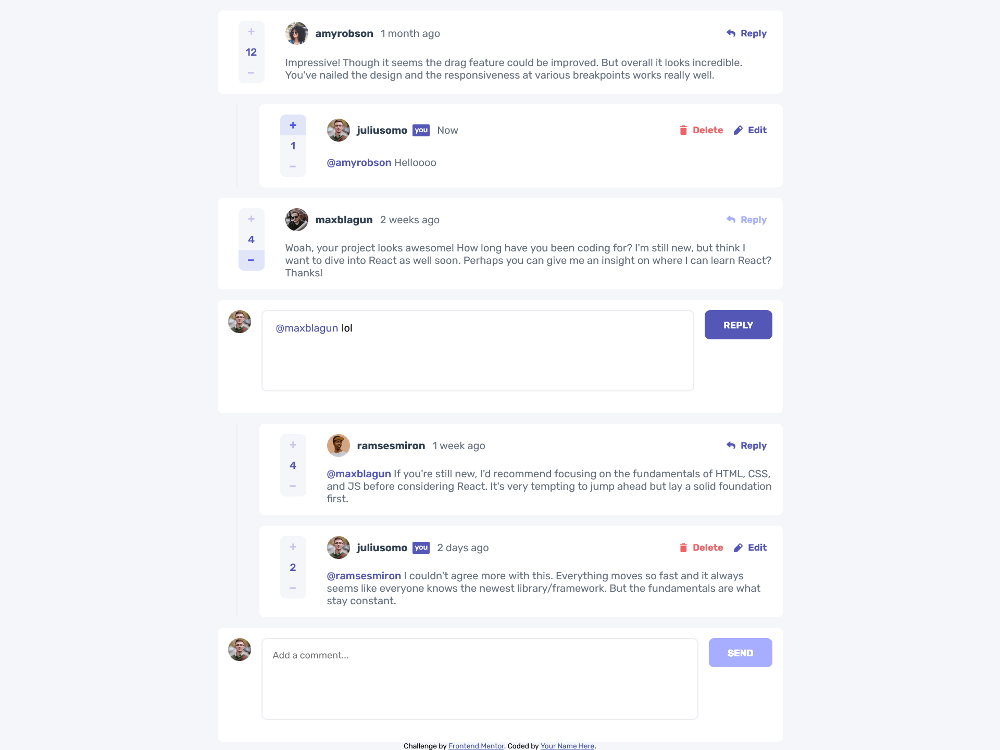

# Frontend Mentor - Interactive comments section solution

This is a solution to the [Interactive comments section challenge on Frontend Mentor](https://www.frontendmentor.io/challenges/interactive-comments-section-iG1RugEG9). Frontend Mentor challenges help you improve your coding skills by building realistic projects.

## Table of contents

- [Overview](#overview)
  - [The challenge](#the-challenge)
  - [Screenshot](#screenshot)
  - [Links](#links)
- [My process](#my-process)
  - [Built with](#built-with)
  - [What I learned](#what-i-learned)
  - [Continued development](#continued-development)
  - [Useful resources](#useful-resources)
- [Author](#author)
- [Acknowledgments](#acknowledgments)

**Note: Delete this note and update the table of contents based on what sections you keep.**

## Overview

### The challenge

Users should be able to:

- View the optimal layout for the app depending on their device's screen size
- See hover states for all interactive elements on the page
- Create, Read, Update, and Delete comments and replies
- Upvote and downvote comments
- **Bonus**: If you're building a purely front-end project, use `localStorage` to save the current state in the browser that persists when the browser is refreshed.
- **Bonus**: Instead of using the `createdAt` strings from the `data.json` file, try using timestamps and dynamically track the time since the comment or reply was posted.

### Screenshot



### Links

- Solution URL: [Add solution URL here](https://your-solution-url.com)
- Live Site URL: [Add live site URL here](https://your-live-site-url.com)

## My process

I wanted to keep this as a vanilla HTML/CSS/JS project, started with the javascript in this case, learned how to create some rudimentary HTML templates

Basically using fetch to get the text content of the html, create a temporary html element "template", replace its innerHTML with the plain text HTML and return the firstElementChild.

Populating the page was not hard and then i got into refining a bit the HTML and styles for the mobile-first desing.

Took more time than what i thought, the active states of this project are no joke with vanilla JS.

I was also able to adapt this to the objective of storing the data into `localStorage` so thats that.

### Built with

- Semantic HTML5 markup
- CSS custom properties
- Flexbox
- CSS Grid
- Mobile-first workflow

### What I learned

I think i should have taken this challenge as an opportunity to learn a framework instead of working with vanilla JS but it was a fun challenge to take. While the code is not that clean i feel kinda proud of this one as it is a little bigger in scope compared to what i usually try doing for fun.

Honorable mentions

Creating HTML out of a template

```javascript
function elementFromHTML(html) {
  /**
   * Convert HTML string to HTML element
   * @param {string} html - HTML string
   */
  const template = document.createElement("template");
  html = html.trim();
  template.innerHTML = html;
  return template.content.firstElementChild;
}

function fetchTemplate(filepath) {
  /**
   * Fetch HTML template from file and transform it to an HTML element
   * @param {string} filepath - Path to HTML file
   */
  return fetch(filepath)
    .then((response) => response.text())
    .then((html) => {
      return elementFromHTML(html);
    })
    .catch((error) => {
      console.log(`Error fetching template: ${error}`);
    });
}
```

Loading state and saving states

```javascript
async function loadState() {
  const jsonFilepath = "./data.json";
  const storedData = localStorage.getItem("appState");
  if (storedData) {
    data = JSON.parse(storedData); // Parse the JSON string into an object
  } else {
    console.log("Data not found in localStorage"); // debugging if the data was loaded from json or not
    data = await loadJsonData(jsonFilepath);
    saveState();
  }
}

function saveState() {
  localStorage.setItem("appState", JSON.stringify(data));
}
```

### Continued development

This could be refined in the future, some ideas are

- The current time thing suggested at the challenge description
- Animations for the different active states
- Refactor this into React or Angular
- Better use of CSS, maybe learn to use SCSS
- Improve the textare in the reply and edit comment text fields since its just a cheap trick with event listeners

### Useful resources

TODO add resources later

## Author

- Frontend Mentor - [@yourusername](https://www.frontendmentor.io/profile/yourusername)

## Acknowledgments

Thanks mom and dad
